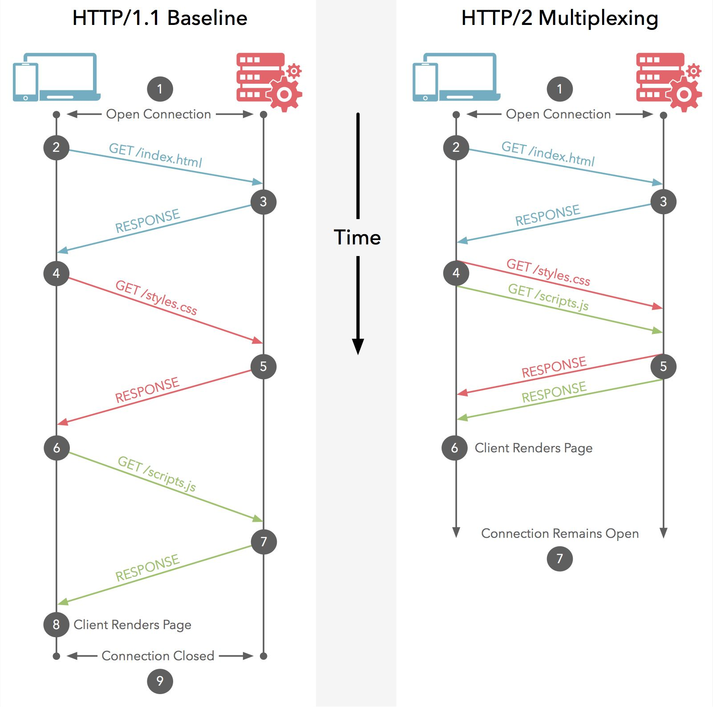

HTTP 2.0 的出现，相比于 HTTP 1.x ，大幅度的提升了 web 性能。在与 HTTP/1.1 完全语义兼容的基础上，进一步减少了网络延迟。而对于前端开发人员来说，无疑减少了在前端方面的优化工作。

### 改进一
> 多路复用 (Multiplexing)

多路复用允许同时通过单一的 HTTP/2 连接发起多重的请求-响应消息。

而在 HTTP/1.1 协议中 浏览器客户端在同一时间，针对同一域名下的请求有一定数量限制。超过限制数目的请求会被阻塞。

这也是为何一些站点会有多个静态资源 CDN 域名的原因之一，目的就是变相的解决浏览器针对同一域名的请求限制阻塞问题。

而 HTTP/2 的多路复用(Multiplexing) 则允许同时通过单一的 HTTP/2 连接发起多重的请求-响应。
多路复用，我们则可以同时请求js和css文件，不同关于http1.1，每次请求一个文件
下面为请求的图解：

### 改进二
> 二进制分帧 
在不改动 HTTP/1.x 的语义、方法、状态码、URI 以及首部字段….. 的情况下, HTTP/2 是如何做到突破 HTTP1.1 的性能限制，改进传输性能，实现低延迟和高吞吐量的 ?

关键之一就是在 应用层(HTTP/2)和传输层(TCP or UDP)之间增加一个二进制分帧层。

在二进制分帧层中， HTTP/2 会将所有传输的信息分割为更小的消息和帧（frame）,并对它们采用二进制格式的编码 ，其中 HTTP1.x 的首部信息会被封装到 HEADER frame，而相应的 Request Body 则封装到 DATA frame 里面。

在过去， HTTP 性能优化的关键并不在于高带宽，而是低延迟。TCP 连接会随着时间进行自我调谐，起初会限制连接的最大速度，如果数据成功传输，会随着时间的推移提高传输的速度。这种调谐则被称为 TCP 慢启动。由于这种原因，让原本就具有突发性和短时性的 HTTP 连接变的十分低效。

HTTP/2 通过让所有数据流共用同一个连接，可以更有效地使用 TCP 连接，让高带宽也能真正的服务于 HTTP 的性能提升。

总结：
1. 单连接多资源的方式，减少服务端的链接压力,内存占用更少,连接吞吐量更大
2. 由于 TCP 连接的减少而使网络拥塞状况得以改善，同时慢启动时间的减少,使拥塞和丢包恢复速度更快

### 改进三
服务端推送

[知乎问答](https://www.zhihu.com/question/34074946)

### HTTP阻止线头问题（HOL问题）

HTTP术语中的行阻塞通常指的是每个浏览器/客户端与服务器的连接数量是有限的，并且通过其中一个连接执行新请求必须等待前一个完成，才可以解雇前一个，执行新的请求。

HTTP /2 通过多路复用的方法解决了这个问题。

从理论上来说，HTTP1.1有流水线操作，也为HOL提供了一种方法，但是实际中流水线操作很难实现并且非常容易出错。

比如请求完html文件后，可以并行的请求js，css文件。

然而， http建立在TCP 之上，TCP也会有自己的HOL。

那就是TCP流的丢包问题， TCP流中的一个丢失数据包使所有的流进入等待状态，直到重新发送和接收该数据包。

使用QUIC协议解决这个HOL问题。

QUIC是一个类似TCP的协议，通过UDP实现，其中每一个流都是独立的，这样丢失的数据包只会暂停丢失数据包所在的流，其他流可以继续进行。