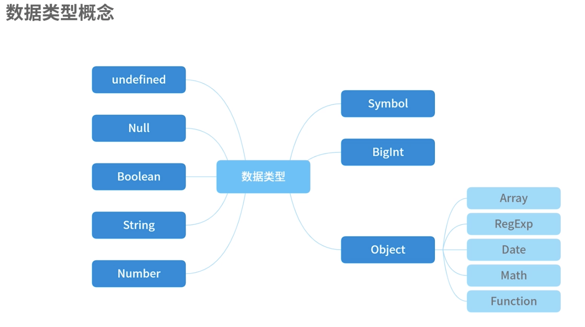

### js八种数据类型
> 基础数据类型
1. undefined
2. null
3. Boolean
4. String
5. Number
6. Symbol(es6)
7. BigInt(es7)

> 引用类型
1. Object
   
   其中包括

   * >Array
   * >RegExp
   * > Date
   * > Math
   * >Function



### 堆内存和栈内存
> 基础数据类型存储在栈neicun中

> 引用类型存储在堆内存中

在js中需要关注的区别是：

堆内存是地址引用(也可以说是值共享)，栈内存是值引用

具体表现看下面例子
```js
let a = 123
let b = a
a // 123
b // 123
b = 456
a // 123 // 修改b不会影响a
b // 456 
let oa = {t: 123}
let ob = oa
oa.t // 123 修改b会影响a
ob.t // 123

ob.t = 456
oa.t // 456
ob.t // 456
```

### 数据类型检测 方法 

> typeof  它虽然可以判断基础数据类型（null 除外），但是引用数据类型中，除了 function 类型以外，其他的也无法判断。

> instanceof  可以准确地判断复杂引用数据类型，但是不能正确判断基础数据类型

手写 instanceof 

```js
function myInstanceof(left, right) {
  // 这里先用typeof来判断基础数据类型，如果是，直接返回false
  if(typeof left !== 'object' || left === null) return false;
  // getProtypeOf是Object对象自带的API，能够拿到参数的原型对象
  let proto = Object.getPrototypeOf(left);
  while(true) {                  //循环往下寻找，直到找到相同的原型对象
    if(proto === null) return false;
    if(proto === right.prototype) return true;//找到相同原型对象，返回true
    proto = Object.getPrototypeof(proto);
    }
}
// 验证一下自己实现的myInstanceof是否OK
console.log(myInstanceof(new Number(123), Number));    // true
console.log(myInstanceof(123, Number));                // false
```

> Object.prototype.toString.call(obj)

### 数据类型转换

#### 强制类型转换
1. Number()
2. parseInt()
3. parseFloat()
4. toString()
5. String()
6. Boolean()

#### 隐式转换
1. == 操作
2. if/while 条件的判断
3. &&、||、 ! 与或非操作
4. +-*/ 数学运算操作
5. \> < <= >=  大小判断操作

#### Object的转换规则

1. 如果部署了[Symbol.toPrimitive]()方法，优先采用这个方法再返回
2. 调用valueOf()，如果转换为基础类型则返回
3. 调用toSting()，如果转为基础类型则返回
4. 如果都没有返回基础类型，会报错

看下面的例子
```js
let obj = {
  value: 1,
  valueOf(){
    return 2
  },
  toSting(){
    return '3'
  },
  [Symbol.toPrimitive](){
    return 4
  }
}
// 采用 + 进行值的隐式转换
console.log(obj+1) // 5
// 特殊的例子
10 + {} // 10[objectObject]
[1,2,3,undefined,4,5] + 10 // 1,2,4,510

// {} 和 [] 都会先调用valueOf,结果还是本身，然后调用toString(),再做运算
```

### 引用类型的浅拷贝与深拷贝

#### 浅拷贝
1. Object.assign()
> 不会拷贝对象的继承属性

> 不会拷贝对象的不可枚举属性

> 可以拷贝Symbol属性

2. 扩展运算符 {...object}
   
3. 手动实现
```js
const shallowClone = (target) => {
  if(typeof target === 'object' && target !== null){
    const cloneTarget = Array.isArray(target) ? [] : {};
    for(let prop in targe){
      if(target.hasOwnProperty(prop)){
        cloneTarget[prop] = target[prop]
      }
      return cloneTarget
    }
  }else{
    return target
  }
}
```

#### 深拷贝
##### JSON.stringfy() / JSON.parse()

> 如果value是function、undefined、symbol，经过stringfy后值会消失

> Date类型会变成字符串

> 不可拷贝不可枚举的属性

> 不可拷贝对象的原型链

> RegExp会变成空对象

> NaN、infinity会变成null

> 不能拷贝对象的循环引用，（obj[key]=obj）

##### 手写实现（基础版）

递归实现

```js
function deepClone(obj){
  let cloneObj = {}
  for(let key in obj){
    if(typeof obj[key] === 'object'){
      cloneObj[key] = deepClone(obj[key])
    }else{
      cloneObj[key] = obj[key]
    }
  }
  return cloneObj
}
```

1. 不能拷贝不可枚举属性以及Symbol属性
2. 只针对普通引用做递归，对于Date,Regexp可能会有错误
3. 没有解决循环引用问题

#### 递归改进版

```js
const isComplexDataType = obj => (typeof obj === 'object' || typeof obj === 'function') && (obj != null)

const deepClone = function(obj,hash = new WeakMap()){
  if(obj.constructor === Date){
    return new Date(obj)
  }
  if(obj.constructor === 'RegExp'){
    return new RegExp(obj)
  }
  if(hash.has(obj))return hash.get(obj)

  let allDesc = Object.getOwnPropertyDescriptors(obj)

  //拿到原型链
  let cloneObj = Object.create(Object.getPrototypeOf(obj),allDesc)
  
  hash.set(obj,cloneObj)

  for(let key of Reflect.ownKeys(obj)){
    cloneObj[key] = isComplexDataType(obj[key]) &&typeof obj[key] !== 'function' ? deepClone(obj[key],hash) : obj[key]
  }
  return cloneObj
}
```


