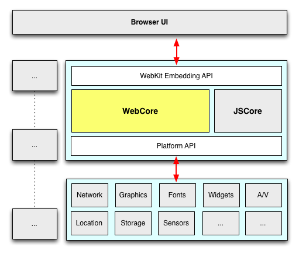
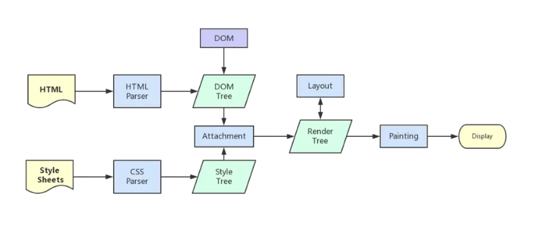
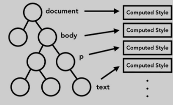
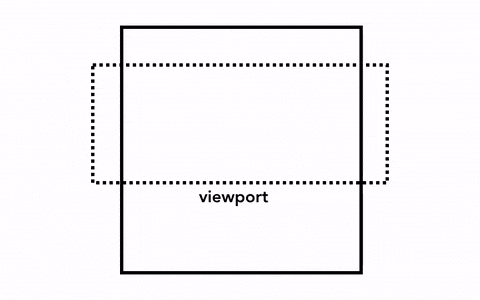
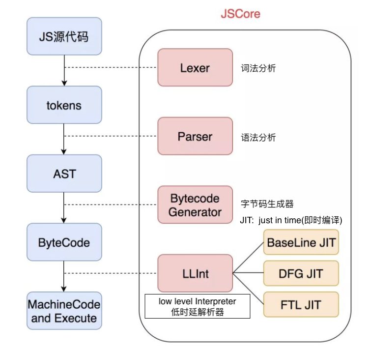
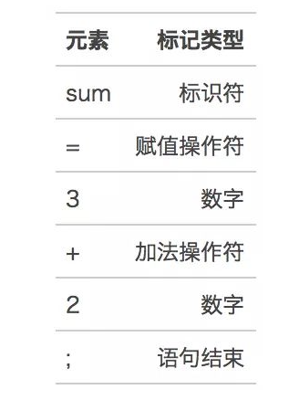
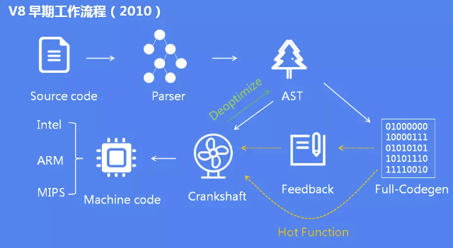
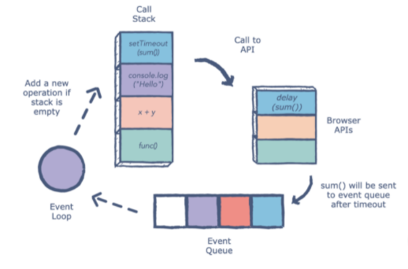
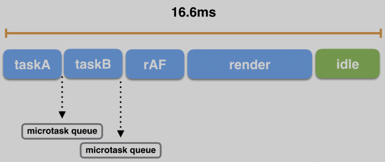

## 前置知识

> 进程： cpu 资源分配的最小单位

> 线程： cpu调度的最小单位

> 进程之间通信： 管道，消息队列，共享内存，信号量，信号， socket。 chrome进程通信统称 IPC

> 浏览器的是多进程，多线程的。 一个tab页可能就对应一个进程，为什么是可能？ 因为多个empty tab 会合并为一个进程

> 浏览器包含哪些进程

* browser 进程，only-one, 浏览器的主进程（主要负责主控与协调）。 负责页面展示（将renderer进程得到的合成帧展示在用户界面，主要交给gpu进程完成）与用户交互， tab页管理， 网络资源的管理与下载。其中主要包括以下线程
    
    UI thread: 控制浏览器自身的按钮（比如回退，刷新）以及输入框（会自动对输入内容检测，如果是url则请求url, 如果是关键词则跳转搜索引擎，搜出搜出对应的url）

    network thread: 处理网络请求(DNS寻址，建立TCP/TLS链接等操作)，从网上获取数据，然后解析http响应报文,如果是一个HTML文件，那么交给渲染进程（Render）处理，如果是zip文件或者其他文件则交给下载管理器。同时会进行网站安全检测，同源检测，避免跨站数据被发送至渲染进程。检查完成之后会告诉ui thread,查找一个渲染进程开始渲染。
    
    storage thread: 控制文件等的访问


* 第三方插件进程， 一种插件对应一个进程，仅当使用该插件时才创建

* GPU进程， 最多一个，用于绘制

* 渲染进程(webkit)(renderer进程)， 默认每个页面一个进程，互不影响。主要包括页面渲染、脚本执行、事件处理等

## 浏览器的渲染进程(webkit)



这是一张webkit的架构图， 第一个红色的双向箭头正如上面提到的，将renderer进程得到的内存中的Bitmap绘制到用户界面。 而整一个过程可简单描述如下

browser进程收到用户请求(例如输入www.baidu.com),那么获取资源，随后将任务通过RendererHost接口传递给Render进程。 Render进程的renderer接口收到消息，简单解析后，交给GUI渲染线程，开始渲染，其中可能需要Browser进程获取资源和GPU进程来帮助渲染， 也可能遇到Js操作dom，导致回流/重绘。最后Render进程将结果传递给Browser进程， Browser进程接收结果并将结果绘制到屏幕上。


位于红色箭头中间的正是 webkit 的核心内容

### webkit主要组成

> web Core

排版引擎， 可以解析html,css，生成dom-tree, render-tree等

> JScore

js引擎， 解析并执行js代码，种类比较多，用的比较多的如下

* Rhino， Mozilla基金会管理，开源，  用java编写

* SpiderMonkey  第一款js引擎， 早期用于Netscape Navigator, 现在用于Mozilla Firefox

*v8 google开源， 主要用c++编写

* javascriptCore 开源， 用于 safari

* chakra 用于IE/Edge

* KJS  用于KED项目中

> Platform API(webkit ports)

主要用于移植不通的平台，也可以说是不同平台的不同实现


WebKit中的许多组件都是可以更换的（图中标灰色的部分）。对于webkit 的描述， 这里引用一句话

"WebKit就像一个三明治。尽管Chromium的包装更像是一个墨西哥卷。一个美味的Web平台墨西哥卷。"     —— Dimitri Glazkov, Chrome WebKit hacker，Web Components和Shadow DOM拥护者。

下面是WebKit的5个port；尽管它们共享了WebCore的大部分。


### 渲染进程的多线程

浏览器的渲染进程是多线程的，主要包括下面 

> GUI渲染线程

  负责渲染浏览器界面，解析html,css,构建dom树, render树，布局绘制等。当重绘或回流时，该线程就会执行。

> js线程（webkit-JSCode工作的地方）

  负责解析执行js代码, js引擎会一直等待任务队列（浏览器事件循环的事件队列）中的任务到来，然后执行。

  注意： js线程与gui线程是互斥的， 如果js执行时间过长，会造成页面渲染阻塞。譬如， js正在进行巨量运算，此时就算gui有更新，也会被保存到在队列，需要等到js引擎空闲后（一般都是在一个EventLoop之后）执行(代码演示，看html/阻塞测试.html)，当然为了解决js处理密集型计算，html5新增 web worker, 这里不详细描述。

> 事件触发线程

据事件发生的坐标，找到目标对象（target），并且将这个目标对象的点击事件绑定的函数（listener）推入js执行栈, 比如鼠标事件，键盘事件等 

> 定时器触发线程

定时计数器并不是由js引擎计数的，因为js引擎是单线程工作的，如果处于阻塞会影响计时的准确性, 当时间到达之后会，将对应的回调推入事件循环的事件队列等待执行

> 异步http请求线程

XMLHttpRequest在连接后是通过浏览器新开一个线程发起请求。当检测到状态变更时，如果设置有回调函数，异步线程就产生状态变更事件，将这个回调再放入

> 合成线程

 将图层划分为图块（tile); 图块栅格化完成后，收集称为“draw quads”的图块信息构建合成帧（compositor Frame），然后通过IPC提交给browser进程

> 多个光栅化线程(光栅线程池)

对图层进行光栅化，得到bitmap(位图， 又名栅格图或点阵图)。
通常，光栅化过程都会使用GPU来加速生成，使用GPU生成位图的过程叫快速栅格化，或者GPU栅格化，生成的位图被保存在GPU内存中。

## web Core 

### 渲染过程



这一张图，描述了渲染的大致流程

> HTML / HTML Parser / DOM Tree  / Style Sheets / CSS parser / Style Tree 

gui线程，拿到html文档，开始解析，如果 css资源加载css资源，并行解析, 如果遇到script，分下面几种情况

* script 不带 async/defer, 

下载并立刻解析执行，jsCore线程运行，gui线程停止，直到jsCore空闲


* script 带 async 属性, 

异步下载脚本，不会阻塞html解析，脚本加载完之后，立刻执行并阻塞html渲染。不管顺序，谁先下载谁先执行

* script 带 defer属性

在html解析完成之后， DOMContentLoaded 触发之前执行;
整个页面在内存中正常渲染结束（DOM 结构完全生成，以及其他脚本执行完成），在window.onload 之前执行；按顺序执行。defer相比preload兼容性好，但是只能对script生效，不能做用于css，img等资源，defer下载并执行，而preload只下载不执行，等到真正使用时才会执行文件

注意⚠️：async/defer只适用于外链不适用于内链 

因此， css不会阻塞HTML解析，但是会阻塞 Render Tree 的生成， 而 script 会阻塞html的解析

>  Attachment

在 webkit中，render Object 是由 DOM节点，调用 attach() 方法创建的，而render object 关联起来就变成了初步的render Tree。 根据 style tree ， attach() 计算了dom节点的样式信息。 如下图： 



> layout（布局）

经过 attachment 后， 我们还需要知道每一个节点在页面上的位置，布局就是找到元素之间几何关系的过程。


gui线程会遍历DOM 及相关元素的计算样式，构建出包含每个元素的页面坐标信息及盒子模型大小的布局树（Render Tree）

如果元素的display属性被设置成了none，或者如果元素的子孙继承了display:none，render object不会被创建，因为DOM 是通过html解析获得，并不关心样式; 而Render tree是根据DOM tree，CSSOM tree来生成，因此， DOM Tree和Render tree并不是一一对应的，设置了display:none的节点不会出现在Render tree上，而在伪元素（before/after）中添加了content值的元素，content的内容会出现在Render tree,不会出现在DOM树里

> Painting 

有了render tree, 我们知道了不同元素的结构，样式，几何关系，但是不知道应该绘制哪一个先。
而painting，并不是真正的进行绘制，而是生成一系列的绘图记录(paint records), 记录这每个元素的绘制顺序和绘制指令。

在chrome的控制台下，打开图层信息， 鼠标右击打开图层分析器可以看到以下信息： 


> 光栅化（raster）与 合成(compositing) （display 之前）

之前说到浏览器渲染进程时，说到 合成线程 会通知光栅化线程对图层进行光栅化，然后收集“draw quads”的图块信息，构建合成帧（compositor frame），通过IPC提交给browser进程进行display。

因此， browser ui 并不是直接采用paint records来进行绘制的


文档结构、元素的样式、元素的几何关系、绘画顺序、绘制指令这些信息都有了，将这些信息转化为显示器中的像素信息(即上面提到的位图 bit map)， 这个过程叫做 光栅化（raster）

要绘制一个页面，最简单的就是只光栅化视口的部分的内容，如果用户发生滚动行为，就滚动光栅帧, 如下图： 



chrome第一个版本采用的就是这种绘制方式，缺点是当页面滚动时，光栅线程都需要对新的视口内容进行光栅化，这是一定的性能损耗，因此Chrome采用一种更加复杂的绘制方式-- 合成（compositing）

合成是将一个页面分成若干层，然后分别对他们进行光栅化，最后在一个单独的线程-合成线程(compositor thread)中，合并成一个页面的的技术。

当用户滚动页面时，由于页面各个层都已经被光栅化了，浏览器需要做的只是合成一个新的帧来展示滚动后的效果罢了。页面的动画效果实现也是类似，将页面上的层进行移动并构建出一个新的帧即可。


为了合成技术以及方便处理Positioning,Clipping,Overflow-scroll,CSS Transfrom/Opacrity/Animation/Filter,Mask or Reflection,Z-indexing等属性，浏览器需要生成另外一棵树：RenderLayer树（简单点就是需要分层）

⚠️ 提示：这里分层与文档流的知识就关联起来了，position为static, relative为标准文档流， 而 absolute就脱离了文档流

浏览器也会为特定的render obj 生成对应的的render layer, 规则如下：

* 是否是页面的根节点

* 是否具备css的一些布局属性(比如： relative absolute fixed or transform)

* 是否透明 transparent/opacity

* 是否溢出  overflow reflection

* 是否有 css滤镜 css filter

* 是否有 will-change属性

* 是否包含 canvas video iframe


当满足上面其中一个条件时，这个Render Object就会被浏览器选中生成对应的Render Layer。

最终，每个RenderObject都会直接或者间接的属于一个RenderLayer


你可能会想要给页面上所有的元素一个单独的层，然而当页面的层超过一定的数量后，层的合成操作要比在每个帧中光栅化页面的一小部分还要慢，因此衡量你应用的渲染性能是十分重要的一件事情。

一旦Layer Tress被创建，渲染顺序被确定，gui线程会把这些信息通知给合成器线程，合成器线程开始对层次数的每一层进行光栅化。

有的层的可以达到整个页面的大小，所以合成线程需要将它们切分为一块又一块的小图块（tiles），之后将这些小图块分别进行发送给一系列光栅线程（raster threads）进行光栅化，结束后光栅线程会将每个图块的光栅结果(即位图 bit map)存在GPU Process的内存中。

当图层上面的图块都被栅格化后，合成线程会收集图块上面叫做绘画四边形（draw quads）的信息来构建一个合成帧（compositor frame）

以上所有步骤完成后，合成线程就会通过IPC向浏览器进程（browser process）提交（commit）一个渲染帧。这个时候可能有另外一个合成帧被浏览器进程的UI线程（UI thread）提交以改变浏览器的UI。这些合成帧都会被发送给GPU从而展示在屏幕上。如果合成线程收到页面滚动的事件，合成线程会构建另外一个合成帧发送给GPU来更新页面。


### 浏览器对事件的处理

以点击事件（click event）为例，让鼠标点击页面时候，首先接受到事件信息的是Browser Process，但是Browser Process只知道事件发生的类型和发生的位置，具体怎么对这个点击事件进行处理，还是由Tab内的Renderer Process进行的。

Browser Process接受到事件后，随后便把事件的信息传递给了渲染进程，`渲染进程的合成线程` 会找到根据事件发生的坐标，找到目标对象（target），事件触发线程将事件推入执行栈，运行目标绑定的函数。

## 一些问题

### 为什么css动画比js动画高效

当对某个元素做几何形状变换、透明度变换或者一些缩放操作时，如果使用JavaScript来写这些效果 ，会牵涉到整个渲染流水线，所以JavaScript的绘制效率会非常低下。可以使用 will-change 来告诉渲染引擎你会对该元素做一些特效变换，好处见下。

```css
.box {
  will-change: transform, opacity;
}
```
这段代码就是提前告诉渲染引擎 box 元素将要做几何变换和透明度变换操作，这时候渲染引擎会将该元素单独实现一帧，等这些变换发生时，渲染引擎会通过合成线程直接去处理变换，这些变换并没有涉及到gui线程，这样就大大提升了渲染的效率。这也是 CSS 动画比JavaScript 动画高效的原因。

劣势：通过will-change来提前告诉渲染引擎，让它为该元素准备独立的层带来的坏处是：它占用的内存也会大大增加，因为从层树开始，后续每个阶段都会多一个层结构，这些都需要额外的内存，因此需要恰当地使用will-change.

<br>

文章内容部分来源(https://mp.weixin.qq.com/s/wcDklFVspWVZbcwG2txFYg)


## `JSCore`

javascript 是一种解析型脚本语言，代码不进行预编译，代码在运行的过程中逐行进行解析。因此，需要一个东西对它进行解析，这就是JSCore。

PS: 严格的讲，语言本身并不存在编译型或者是解释型，因为语言只是一些抽象的定义与约束，并不要求具体的实现，执行方式。这里讲JS是一门“解释型语言”只是JS一般是被JS引擎动态解释执行，而并不是语言本身的属性

能解析js的软件有很多，其中v8性能显著，而大多数的js代码执行，基本都遵循以下流程：

 

### `词法分析`

把js代码分解成 Token 序列的过程， 也可以叫做分词

这一过程由 Lexer完成，有的编译器或者解析器把分词叫做 Scanner

例如下面的 表达式

```js
sum = 3 + 2
```

将其标记之后，得到下表的内容： 



词法分析不会关注每个token之间的关联，是否匹配， 仅仅是把他们区分开来，等待语法分析来把这些 Token 串起来。


### `语法分析 Parser`

就像人与人交流一样，语言都是有语法规则的，双方都懂语法，才能听的懂。

因此，Parser会对Tokens序列进行语法分析，并生成对应的一颗抽象语法树（AST）

[AST在线生成](https://esprima.org/demo/parse.html#)

### `生成字节码 ByteCodeGenerator`

以 v8 为例讲述

在 v8中，将 AST 转换为字节码这一过程叫Ignition 阶段。 

V8引擎的诞生带着使命而来，就是要在速度和内存回收上进行革命的。JavaScriptCore（Safari的JSCore）的架构是采用生成字节码的方式，然后执行字节码。Google觉得JavaScriptCore这套架构不行，生成字节码会浪费时间，不如直接生成机器码快。所以V8在前期的架构设计上是非常激进的，采用了直接编译成机器码的方式。



早期的V8有Full-Codegen和Crankshaft两个编译器。V8 首先用 Full-Codegen把所有的代码都编译一次，生成对应的机器码。JS在执行的过程中，V8内置的Profiler筛选出热点函数并且记录参数的反馈类型，然后交给 Crankshaft 来进行优化。所以Full-Codegen本质上是生成的是未优化的机器码，而Crankshaft生成的是优化过的机器码。

随着版本的引进，网页的复杂化，V8也渐渐的暴露出了自己架构上的缺陷：

1. Full-Codegen编译直接生成机器码，导致内存占用大

2. Full-Codegen编译直接生成机器码，导致编译时间长，导致启动速度慢

3. Crankshaft 无法优化try，catch和finally等关键字划分的代码块

4. Crankshaft新加语法支持，需要为此编写适配不同的Cpu架构代码

为了解决上述缺点，V8还是采用JavaScriptCore（Safari的JSCore）的架构，生成字节码。


Ignition是V8的解释器，用于将抽象语法树转换成字节码

### `生成机器码 (LLint)`

还是以v8 为例： 

v8 通过  Turbofan将字节码转位机器码

TurboFan 编译器，它是 JIT 优化的编译器，旨在解决Crankshaft的缺点。 Crankshaft只能优化JavaScript语言的子集。例如，它不是设计用于使用结构化异常处理优化JavaScript代码，即由JavaScript的try，catch和finally关键字划分的代码块。很难在Crankshaft中添加对新语言功能的支持，因为这些功能几乎总是需要为九个支持的平台编写特定于体系结构的代码。

同时 V8 引擎是多线程的，TurboFan 的编译线程和生成字节码不会在同一个线程上，这样可以和 Ignition 解释器相互配合着使用，不受另一方的影响。

Ignition的字节码可以直接用TurboFan生成优化的机器代码，而不必像Crankshaft那样从源代码重新编译。Ignition的字节码在V8中提供了更清晰且更不容易出错的基线执行模型，简化了去优化机制，这是V8 自适应优化的关键特性。最后，由于生成字节码比生成Full-codegen的基线编译代码更快，因此激活Ignition通常会改善脚本启动时间，从而改善网页加载。

### 垃圾回收机制 GC
js执行后，是会占用内存空间的，单js本身并不具备释放空间的能力，因此，JSCore需要有GC机制

V8 GC机制 [参考文章8.垃圾回收机制](./8.%E5%9E%83%E5%9C%BE%E5%9B%9E%E6%94%B6%E6%9C%BA%E5%88%B6.md)

## `JSCore值得注意的Feature`

 ### `基于寄存器的指令集结构`

 JSCore采用的是基于寄存器的指令集结构，相比于基于栈的指令集结构（比如有些JVM的实现），因为不需要把操作结果频繁入栈出栈，所以这种架构的指令集执行效率更高。但是由于这样的架构也造成内存开销更大的问题，除此之外，还存在移植性弱的问题，因为虚拟机中的虚拟寄存器需要去匹配到真实机器中CPU的寄存器，可能会存在真实CPU寄存器不足的问题。

 基于寄存器的指令集结构通常都是三地址或者二地址的指令集，例如：

 ```js
i = a + b;
//转成三地址指令:
add i，a，b; //把a寄存器中的值和b寄存器中的值相加，存入i寄存器

 ```

在三地址的指令集中的运算过程是把a和b分别mov到两个寄存器，然后把这两个寄存器的值求和之后，存入第三个寄存器。这就是三地址指令运算过程。

而基于栈的一般都是零地址指令集，因为它的运算不依托于具体的寄存器，而是使用对操作数栈和具体运算符来完成整个运算。


### `单线程机制`

值得注意的是，整个JS代码是执行在一条线程里的，它并不像我们使用的OC、Java等语言，在自己的执行环境里就能申请多条线程去处理一些耗时任务来防止阻塞主线程。JS代码本身并不存在多线程处理任务的能力。但是为什么JS也存在多线程异步呢？强大的事件驱动机制，是让JS也可以进行多线程处理的关键。

### `事件驱动机制`

从事件角度说，事件驱动程序的基本结构是由一个事件收集器、一个事件发送器和一个事件处理器组成。

JS的诞生就是为了让浏览器也拥有一些交互，逻辑处理能力。而JS与浏览器之间的交互是通过事件来实现的，比如浏览器检测到发生了用户点击，会传递一个点击事件通知JS线程去处理这个事件

而JS线程和工作线程，以及浏览器事件之间的`通信机制`叫做事件循环（EventLoop



* CallStack 执行栈

* Browser APIS 浏览器 api

* Event Queue 事件队列， 分为 宏任务 Macro Tasks 和 微任务 Micro Tasks

结合下面这段代码去分析，EventLoop是如何工作的

```html
<script>
  setTimeout(function test() {
    console.log('setTimeout');
  },1000);

  new Promise(resolve => {
    console.log('promise 1')
    resolve('promise 1')
  });

  new Promise(resolve => resolve('promise 2')).then(res => {
    console.log(res);
    return 'promise 2 continue';
  }).then(res2 => {
    console.log(res2);
  });
  new Promise(resolve => {
    setTimeout(() => resolve('promise 3'), 2000)
  }).then(res => {
    console.log(res);
  });
  console.log('end')
</script>
```


1. 当GUI线程，解析到 script标签，那么停止解析html， JS线程运行（JS线程与GUI线程是互斥的）

2. 整一个 script 作为一个宏任务进入 callStack(执行栈),立刻执行

3. 遇到 setTimeout（属于Browser API）, 启动定时器线程开始计时

4. 遇到 第一个 Promise,同步 resolve, 但是没有then, 没产生微任务，继续执行

5. 遇到 第二个 Promise, 同步 resolve，then产生微任务，microTasks->[promise2], 继续执行同步代码

6. 遇到第三个promise, 异步 setTimeout里面resolve, 定时器线程开始计时, 延后resolve,不产生微任务

7. 本轮同步任务执行完毕，检查任务队列，先检查微任务队列，发现 microTasks->[promise2.then], 有 promise2的then回调,执行then的回调，产生新的promise,继续then,microTasks->[promise2.then.continue]

8. 继续检查任务队列，microTasks->[promise2.then.continue], 执行完毕， 宏任务微任务队列都为空

9. 开始下一轮EventLoop,此时，1秒过去了， setTimeout被推入宏任务队列,

10. setTimeout的回调被执行, 没产生任何任务

11. 开始下一轮EventLoop,此时,2秒过去了, setTimeout,的回调被执行，并 resolve(promise 3), 产生微任务，microTasks->[promise3]

12. 检查任务队列， 执行 promise3的then回调

因此， 输出结果 

```js
promise 1
end
promise 2
promise 2 continue
setTimeout
promise 3
```

总结： 一次 EventLoop 循环会处理一个宏任务和所有这次循环中产生的微任务。

<br>

（JSCore内容来源1. http://t.zoukankan.com/vivotech-p-12029523.html  2. https://zhuanlan.zhihu.com/p/42859905）


## 浏览器一帧

浏览器是一帧一帧的渲染页面的。一般的浏览器的刷新率为 60 Hz, 即一秒钟刷新60次

`1000ms / 60Hz ≈ 16.7`

大概每过16.7ms，浏览器会渲染一帧画面， 而这段时间内浏览器大体会做两件事： tasks 与 render


task(JSCore工作的东西)

render(webCore工作的东西)

假如有个 setTimeout 时间是 10ms, 在 16.6ms内，那么会在这一帧渲染之前执行，大于这个那么在下一帧

但是 setTimeout 的时间控制不是精准的，不能确保什么时候执行，那么有什么办法可以保证代码在每一帧都执行呢？

### `requestAnimationFrame（简称rAF）`

rAF会在每一帧render前被调用。


一般被用来绘制动画，因为当动画代码执行完后接下来就进入render。动画效果可以最快被呈现。

图中的rFA指的是 rFA的回调，而这一个回调是上一帧给的。
因此， rFA的回调总是在下一帧render之前执行
(具体也可以看[MDN文档对于rFA的介绍](https://developer.mozilla.org/zh-CN/docs/Web/API/Window/requestAnimationFrame))。如果理解不了这句，看一下面这一段代码，requestAnimationFrame在 step外面调用了一次， 而在step里面也调用一次。每一次都是将step作为参数。

 代码来自 mdn文档
```js
const element = document.getElementById('some-element-you-want-to-animate');
let start, previousTimeStamp;
let done = false

function step(timestamp) {
  if (start === undefined) {
    start = timestamp;
  }
  const elapsed = timestamp - start;

  if (previousTimeStamp !== timestamp) {
    // 这里使用 `Math.min()` 确保元素刚好停在 200px 的位置。
    const count = Math.min(0.1 * elapsed, 200);
    element.style.transform = 'translateX(' + count + 'px)';
    if (count === 200) done = true;
  }

  if (elapsed < 2000) { // 在两秒后停止动画
    previousTimeStamp = timestamp;
    if (!done) {
      window.requestAnimationFrame(step);
    }
  }
}
window.requestAnimationFrame(step);
```

如果 tasks和render之后，还有时间，改怎么利用？

### `requestIdleCallback`

你可以使用requestIdleCallbackAPI，如果渲染完成后还有空闲时间，则这个API会被调用。



如果 tasks 执行时间过长, 那么则会造成掉帧

### `掉帧与时间切片`


如图taskA执行时间超过了16.6ms（比如taskA中有个很耗时的while循环）。

那么这一帧就没有时间render，页面直到下一帧render后才会更新。表现为页面卡顿一帧，或者说掉帧。

有什么好的解决办法么？

刚才提到的requestIdleCallback是一个解决办法。我们可以将一部分工作放到空闲时间中执行。

如图我们将taskA拆分为2个task。则每一帧都有机会render。这样就能减少掉帧的可能。


为了解决掉帧造成的卡顿，React16将递归的构建方式改为可中断的遍历。

以5ms的执行时间划分task，每遍历完一个节点，就检查当前task是否已经执行了5ms。

如果超过5ms，则中断本次task。


通过将task执行时间切分为一个个小段，减少长时间task造成无法render的情况。这就是时间切片。

<br>

(文章内容来源： https://juejin.cn/post/6873337391608758285)