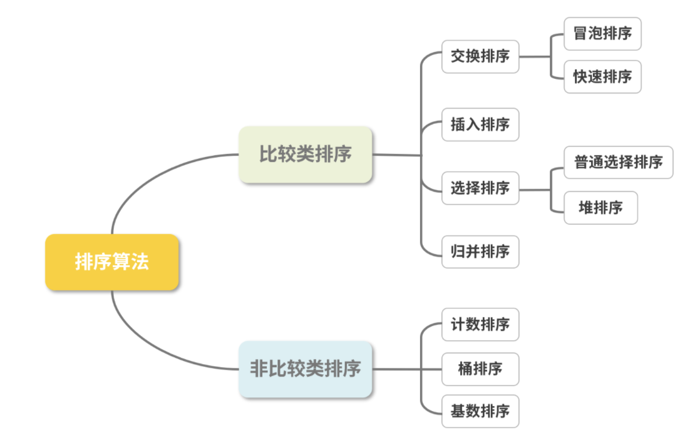

数据结构算法中排序有很多种，常见的、不常见的，至少包含十种以上。根据它们的特性，可以大致分为两种类型：比较类排序和非比较类排序。

* 比较类排序：通过比较来决定元素间的相对次序，其时间复杂度不能突破 O(nlogn)，因此也称为非线性时间比较类排序。

* 非比较类排序：不通过比较来决定元素间的相对次序，它可以突破基于比较排序的时间下界，以线性时间运行，因此也称为线性时间非比较类排序。

我们通过一张图片来看看这两种分类方式分别包括哪些排序方法。



非比较类的排序在实际情况中用的比较少，故本讲主要围绕比较类排序展开讲解。其实根据排序的稳定性，也可以分为稳定排序和不稳定排序，例如快速排序就是不稳定的排序、冒泡排序就是稳定的排序。我在最后总结的部分会帮助你再次区分。

### 冒泡排序
```js
function bubbleSort(arr){
  let len = arr.length
  if(len < 2>) return
  for(let i = 0 ; i < len;i++){
    for(let j = 0; j < i; j++){
      if(arr[j] > arr[i]){
        let temp = arr[j];
        arr[j] = arr[i];
        arr[i] = temp
      }
    }
  }
  return arr
}
```

### 快速排序
```js
var a = [1, 3, 6, 3, 23, 76, 1, 34, 222, 6, 456, 221];
function quickSort(array) {
  var quick = function(arr) {
    if (arr.length <= 1) return arr
    const index = Math.floor(len >> 1)
    const pivot = arr.splice(index, 1)[0]
    const left = []
    const right = []
    for (let i = 0; i < arr.length; i++) {
      if (arr[i] > pivot) {
        right.push(arr[i])
      } else if (arr[i] <= pivot) {
        left.push(arr[i])
      }
    }
    return quick(left).concat([pivot], quick(right))
  }
  const result = quick(array)
  return result
}
quickSort(a);//  [1, 1, 3, 3, 6, 6, 23, 34, 76, 221, 222, 456]
```

### 插入排序
```js
var a = [1, 3, 6, 3, 23, 76, 1, 34, 222, 6, 456, 221];
function insertSort(array) {
  const len = array.length
  let current
  let prev
  for (let i = 1; i < len; i++) {
    current = array[i]
    prev = i - 1
    while (prev >= 0 && array[prev] > current) {
      array[prev + 1] = array[prev]
      prev--
    }
    array[prev + 1] = current
  }
  return array
}
insertSort(a); // [1, 1, 3, 3, 6, 6, 23, 34, 76, 221, 222, 456]
```

### 选择排序
选择排序是一种简单直观的排序算法。它的工作原理是，首先将最小的元素存放在序列的起始位置，再从剩余未排序元素中继续寻找最小元素，然后放到已排序的序列后面……以此类推，直到所有元素均排序完毕。请看下面的代码。
```js
var a = [1, 3, 6, 3, 23, 76, 1, 34, 222, 6, 456, 221];
function selectSort(array) {
  const len = array.length
  let temp
  let minIndex
  for (let i = 0; i < len - 1; i++) {
    minIndex = i
    for (let j = i + 1; j < len; j++) {
      if (array[j] <= array[minIndex]) {
        minIndex = j
      }
    }
    temp = array[i]
    array[i] = array[minIndex]
    array[minIndex] = temp
  }
  return array
}
selectSort(a); // [1, 1, 3, 3, 6, 6, 23, 34, 76, 221, 222, 456]
```

### 堆排序
堆排序是指利用堆这种数据结构所设计的一种排序算法。堆积是一个近似完全二叉树的结构，并同时满足堆积的性质，即子结点的键值或索引总是小于（或者大于）它的父节点。堆的底层实际上就是一棵完全二叉树，可以用数组实现。

根节点最大的堆叫作大根堆，根节点最小的堆叫作小根堆，你可以根据从大到小排序或者从小到大来排序，分别建立对应的堆就可以。请看下面的代码。

```js
var a = [1, 3, 6, 3, 23, 76, 1, 34, 222, 6, 456, 221];
function heap_sort(arr) {
  var len = arr.length
  var k = 0
  function swap(i, j) {
    var temp = arr[i]
    arr[i] = arr[j]
    arr[j] = temp
  }
  function max_heapify(start, end) {
    var dad = start
    var son = dad * 2 + 1
    if (son >= end) return
    if (son + 1 < end && arr[son] < arr[son + 1]) {
      son++
    }
    if (arr[dad] <= arr[son]) {
      swap(dad, son)
      max_heapify(son, end)
    }
  }
  for (var i = Math.floor(len / 2) - 1; i >= 0; i--) {
    max_heapify(i, len)
  }
  for (var j = len - 1; j > k; j--) {
    swap(0, j)
    max_heapify(0, j)
  }
  return arr
}
heap_sort(a); // [1, 1, 3, 3, 6, 6, 23, 34, 76, 221, 222, 456]
```

从代码来看，堆排序相比上面几种排序整体上会复杂一些，不太容易理解。不过你应该知道两点：一是堆排序最核心的点就在于排序前先建堆；二是由于堆其实就是完全二叉树，如果父节点的序号为 n，那么叶子节点的序号就分别是 2n 和 2n+1。

你理解了这两点，再看代码就比较好理解了。堆排序最后有两个循环：第一个是处理父节点的顺序；第二个循环则是根据父节点和叶子节点的大小对比，进行堆的调整。通过这两轮循环的调整，最后堆排序完成。

### 归并排序
归并排序是建立在归并操作上的一种有效的排序算法，该算法是采用分治法的一个非常典型的应用。将已有序的子序列合并，得到完全有序的序列；先使每个子序列有序，再使子序列段间有序。若将两个有序表合并成一个有序表，称为二路归并。我们先看一下代码。
```js
var a = [1, 3, 6, 3, 23, 76, 1, 34, 222, 6, 456, 221];

function mergeSort(array) {
  const merge = (right, left) => {
    const result = []
    let il = 0
    let ir = 0
    while (il < left.length && ir < right.length) {
      if (left[il] < right[ir]) {
        result.push(left[il++])
      } else {
        result.push(right[ir++])
      }
    }
    while (il < left.length) {
      result.push(left[il++])
    }
    while (ir < right.length) {
      result.push(right[ir++])
    }
    return result
  }
  const mergeSort = array => {
    if (array.length === 1) { return array }
    const mid = Math.floor(array.length / 2)
    const left = array.slice(0, mid)
    const right = array.slice(mid, array.length)
    return merge(mergeSort(left), mergeSort(right))
  }
  return mergeSort(array)
}
mergeSort(a); // [1, 1, 3, 3, 6, 6, 23, 34, 76, 221, 222, 456]
```

从上面这段代码中可以看到，通过归并排序可以得到想要的结果。上面提到了分治的思路，你可以从 mergeSort 方法中看到，通过 mid 可以把该数组分成左右两个数组，分别对这两个进行递归调用排序方法，最后将两个数组按照顺序归并起来。

归并排序是一种稳定的排序方法，和选择排序一样，归并排序的性能不受输入数据的影响，但表现比选择排序好得多，因为始终都是 O(nlogn) 的时间复杂度。而代价是需要额外的内存空间。